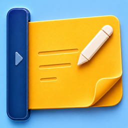

# PinLeaf – Sticky Notes

<p align="center">
  
</p>

<p align="center">
  화면 가장자리에 접어 두고 필요할 때 펼쳐 쓰는 macOS용 플로팅 메모 앱
</p>

PinLeaf – Sticky Notes는 화면의 왼쪽 또는 오른쪽 가장자리에 노트 목록을 숨겨 두었다가 마우스를 올리면 펼쳐지는 macOS 앱입니다. 각 노트는 독립적인 플로팅 패널로 열리며, 원하는 위치와 크기로 배치할 수 있습니다.

## 주요 기능

- 화면 가장자리에서 마우스 호버로 열리는 노트 목록 패널
- 왼쪽·오른쪽 목록 위치와 접힌 상태 노출 비율 설정
- 목록 패널 고정 및 비활성 상태 투명도 조절
- 항상 위에 표시되는 개별 플로팅 노트
- 노트별 위치와 창 크기 자동 복원
- 일반 텍스트 및 Markdown 편집·미리보기
- 노트별 편집/읽기 모드 기억
- 노랑, 분홍, 하늘, 연두, 보라의 5가지 노트 색상
- 노트별 50%~200% 확대·축소 설정
- 열려 있는 노트 전체 숨기기 및 이전 위치로 복원
- 제목, 내용, 색상, 확대 비율, 창 위치를 로컬 JSON 파일에 자동 저장
- Dock 아이콘 표시 여부 설정
- 포커스를 잃은 플로팅 노트의 타이틀 바 자동 숨김

## 사용 방법

1. 화면 가장자리에서 반투명하게 보이는 패널 영역에 마우스를 올립니다.
2. `+` 아이콘을 눌러 새 노트를 만듭니다.
3. 노트 목록의 항목을 클릭해 해당 노트를 표시하거나 숨깁니다.
4. 플로팅 노트를 드래그하거나 크기를 조절해 원하는 위치에 배치합니다.
5. 연필과 눈 아이콘으로 편집 모드와 Markdown 읽기 모드를 전환합니다.
6. 목록 상단의 눈 아이콘으로 현재 열린 노트를 한 번에 숨기거나 다시 복원합니다.

노트를 삭제하려면 목록의 노트를 보조 클릭한 다음 `삭제`를 선택합니다.

## 단축키

| 단축키 | 기능 |
| --- | --- |
| `⌘N` | 새 노트 추가 |
| `⌘Q` | PinLeaf 종료 |
| `⌘+` | 현재 노트 확대 |
| `⌘-` | 현재 노트 축소 |
| `⌘0` | 현재 노트를 100% 크기로 복원 |

확대·축소 단축키는 플로팅 노트가 활성화되어 있을 때 동작합니다.

## 설정

노트 목록 상단의 톱니바퀴 아이콘을 누르면 독립된 설정 창이 열립니다.

| 설정 | 범위 및 기본값 |
| --- | --- |
| 목록 위치 | 왼쪽 또는 오른쪽, 기본값 왼쪽 |
| 노트 목록 패널 너비 | 180~350pt, 기본값 280pt |
| Dock 아이콘 표시 | 켜기 또는 끄기, 기본값 켜기 |
| 목록 표시량 | 작게 7개, 보통 14개, 많이 21개 |
| 비활성 투명도 | 10~90%, 기본값 42% |
| 접힌 상태 노출 비율 | 5~30%, 기본값 10% |

핀 아이콘을 활성화하면 마우스 포커스가 다른 곳으로 이동해도 노트 목록 패널이 접히지 않습니다.

## 개발 환경

- Swift 5
- SwiftUI 및 AppKit
- Xcode 26.x
- macOS 26.5 이상

현재 프로젝트의 배포 대상은 macOS 26.5로 설정되어 있습니다. 더 이전 버전을 지원하려면 Xcode의 프로젝트 설정에서 Deployment Target을 낮춘 뒤 API 호환성을 확인해야 합니다.

## 빌드 및 실행

1. 저장소를 복제합니다.

   ```bash
   git clone <repository-url>
   cd MySideNotes
   ```

2. Xcode에서 `MySideNotes.xcodeproj`를 엽니다.

   ```bash
   open MySideNotes.xcodeproj
   ```

3. 상단 Scheme에서 `PinLeaf`를 선택합니다.
4. 실행 대상을 `My Mac`으로 선택하고 `⌘R`을 누릅니다.

처음 빌드할 때 코드 서명 오류가 발생하면 Target의 **Signing & Capabilities**에서 자신의 Development Team을 선택합니다.

## 응용 프로그램 폴더에 설치

1. Xcode에서 Release 구성으로 앱을 빌드합니다.
2. Product 메뉴의 **Show Build Folder in Finder**를 선택합니다.
3. `Products/Release/PinLeaf.app`을 `/Applications` 폴더로 복사합니다.

기존 설치본이 있다면 앱을 완전히 종료한 후 교체하는 것이 안전합니다.

## 데이터 저장

노트는 `notes.json` 파일에 자동 저장됩니다. 저장 위치는 사용자의 Application Support 영역 아래에 있는 앱 데이터 디렉터리입니다. 기존 노트와 설정을 유지하기 위해 Bundle ID는 `SSG.MySideNotes`를 계속 사용합니다.

macOS App Sandbox 적용 여부에 따라 실제 경로는 다음 중 하나가 될 수 있습니다.

```text
~/Library/Application Support/SSG.MySideNotes/notes.json
~/Library/Containers/SSG.MySideNotes/Data/Library/Application Support/SSG.MySideNotes/notes.json
```

앱을 삭제하거나 초기화하기 전에 `notes.json`을 복사하면 노트를 백업할 수 있습니다.

## 프로젝트 구조

```text
MySideNotes/
├── AppDelegate.swift                    # 앱 생명주기와 초기 패널 구성
├── EdgePanelController.swift            # 가장자리 감지, 슬라이드 및 패널 배치
├── NoteWorkspaceView.swift              # 노트 목록과 상단 도구 모음
├── FloatingNotePanelManager.swift       # 플로팅 노트 표시·숨김·복원 관리
├── FloatingNotePanelController.swift    # 개별 NSPanel과 타이틀 바 동작
├── FloatingNoteView.swift               # 노트 편집기와 하단 상태 표시줄
├── FloatingMarkdownPreview.swift        # Markdown 읽기 화면
├── Note.swift                           # 노트 데이터 모델
├── NoteStore.swift                      # 노트 CRUD와 저장 예약
├── NoteFileRepository.swift             # JSON 파일 입출력
├── PanelPresentationState.swift         # 패널 설정과 UserDefaults 연동
└── PanelSettingsView.swift              # 설정 화면
```

